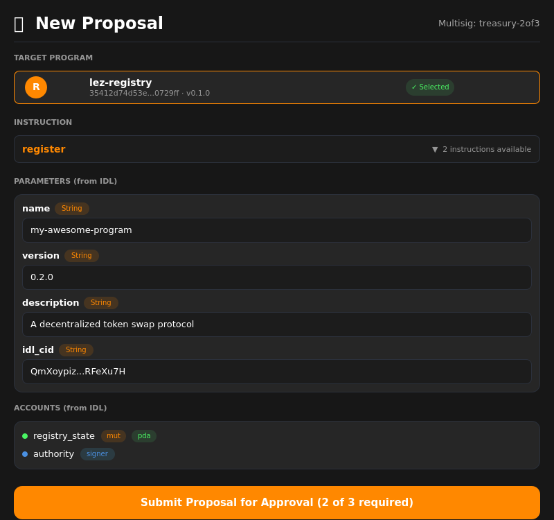

# LEZ Multisig Module

Qt plugin for Logos Core providing M-of-N multisig governance with registry integration.

## Screenshots

### Proposal List


### Propose Form (IDL-generated fields from Registry)


## Architecture

```
QML UI → Qt C++ Plugin → C FFI → Rust (lez-multisig / lez-registry)
```

- **Qt Module**: `liblez_multisig_module.so` — loaded by `logoscore`
- **Multisig FFI**: `liblez_multisig_ffi.so` — create/propose/approve/reject/execute
- **Registry FFI**: `liblez_registry_ffi.so` — browse programs, fetch IDLs for dynamic form generation

## Features

- Create M-of-N multisigs with configurable threshold and members
- Browse the program registry to select target programs
- Auto-generate proposal forms from program IDLs
- Track proposal status: Active, Approved, Rejected, Executed
- Manual IDL JSON input as fallback (Advanced mode)

## Building

### Plugin (for Logos Core)
```bash
nix build .#lib
```

### Standalone App
```bash
nix build .#app
```

## Testing

```bash
# Load module in logoscore
logoscore --call "liblez_multisig_module.listProposals({})"
```

## Design

Uses the [Logos Design System](https://github.com/logos-co/logos-design-system) — dark theme with orange accent, consistent with `logos-app-poc`.

## Related Repos

- [lez-multisig](https://github.com/jimmy-claw/lez-multisig) — Rust core + FFI (branch: `jimmy/nssa-framework-migration`)
- [lez-registry](https://github.com/jimmy-claw/lez-registry) — Program registry core + FFI
- [logos-lez-registry-module](https://github.com/jimmy-claw/logos-lez-registry-module) — Registry Qt module
- [logos-app-poc](https://github.com/logos-co/logos-app-poc) — Unified Logos app shell
